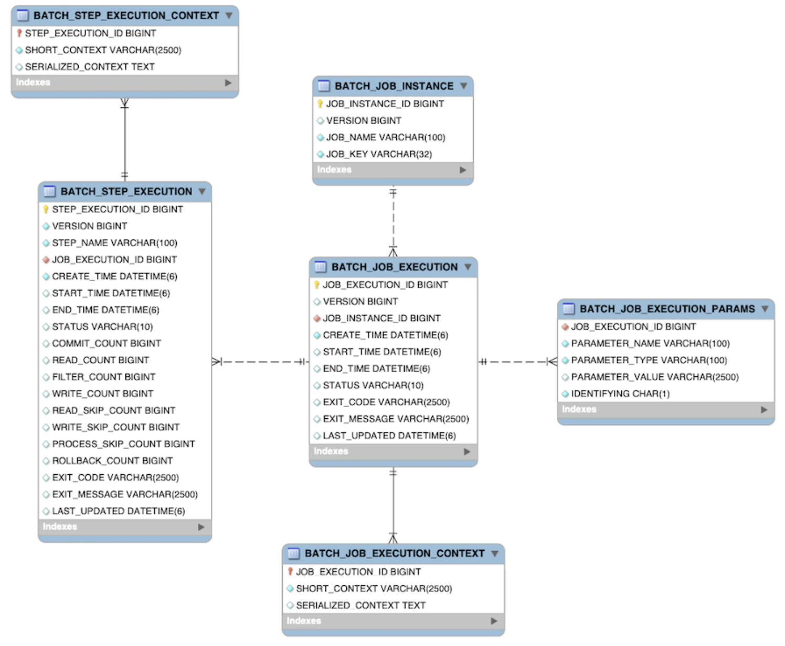
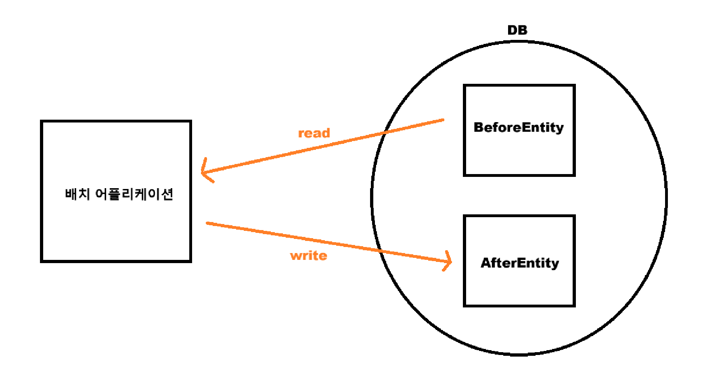
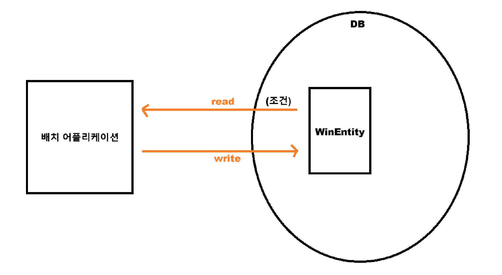
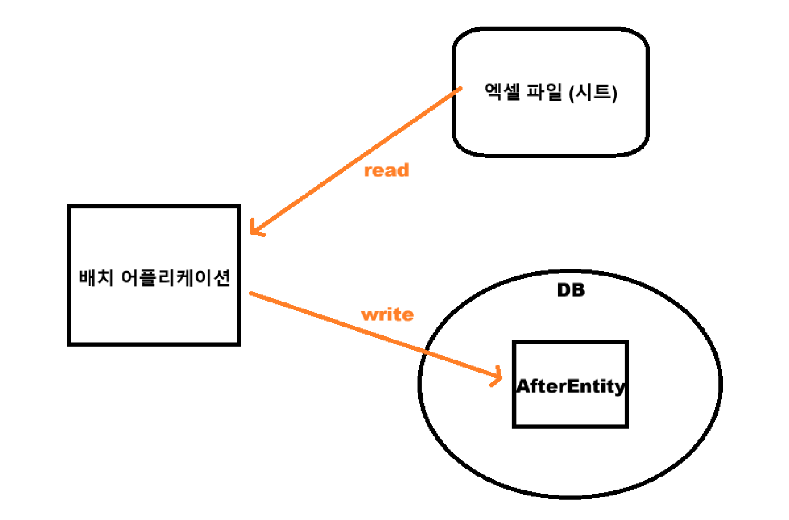
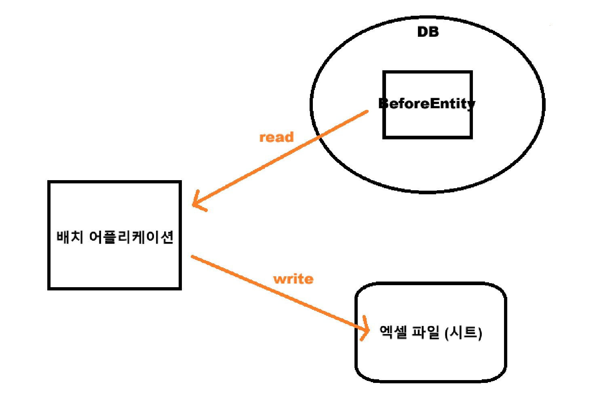

📚 이 프로젝트는 Spring Batch의 기본 개념을 학습하고, 배치 처리의 메타데이터 관리와 관련된 기능을 구현하는 데 중점을 둡니다.

---

## 실행 환경

- Java 17
- Spring Boot 3.3.1
- Spring Batch 5.1.2

---

## 퀵 스타트

- docker-compose 컨테이너 생성

```shell
$ docker compose up -d
```

---

### Spring batch Diagram


<br>

### Spring batch Meta-Data Table ERD



<a href="https://docs.spring.io/spring-batch/reference/schema-appendix.html" target="_blank">참고 공식 문서</a>

---
### 1. Table to Table



<br>

- FirstBatch.java
```java
@RequiredArgsConstructor
@Configuration
public class FirstBatch {

    private final JobRepository jobRepository;
    private final PlatformTransactionManager platformTransactionManager;

    private final BeforeRepository beforeRepository;
    private final AfterRepository afterRepository;

    @Bean
    public Job firstJob() {
        return new JobBuilder("firstJob", jobRepository)
                .start(firstStep())
//                .next() job이 여러 개일 경우 next()로 추가
                .build();
    }

    // 읽기 → 처리 → 쓰기 작업은 청크 단위로 진행
    @Bean
    public Step firstStep() {
        return new StepBuilder("firstStep", jobRepository)
                .<BeforeEntity, AfterEntity>chunk(10, platformTransactionManager)
                .reader(beforeReader())
                .processor(middleProcessor())
                .writer(afterWriter())
                .build();
    }

    // 청크 단위까지만 읽기 때문에 findAll을 하더라도 chunk 개수(10개) 만큼 사용
    @Bean
    public RepositoryItemReader<BeforeEntity> beforeReader() {
        return new RepositoryItemReaderBuilder<BeforeEntity>()
                .name("beforeReader")
                .pageSize(10)
                .methodName("findAll")
                .repository(beforeRepository)
                .sorts(Map.of("id", Sort.Direction.ASC))
                .build();
    }

    // 읽어온 데이터를 처리하는 Process
    @Bean
    public ItemProcessor<BeforeEntity, AfterEntity> middleProcessor() {
        return item -> {
            AfterEntity afterEntity = new AfterEntity();
            afterEntity.setUsername(item.getUsername());
            return afterEntity;
        };
    }

    // AfterEntity에 처리한 결과를 저장하는 Writer
    @Bean
    public RepositoryItemWriter<AfterEntity> afterWriter() {
        return new RepositoryItemWriterBuilder<AfterEntity>()
                .repository(afterRepository)
                .methodName("save")
                .build();
    }
}
```

---

### 2. Table Conditions



- SecondBatch.java
```java
@RequiredArgsConstructor
@Configuration
public class SecondBatch {

    private final JobRepository jobRepository;
    private final PlatformTransactionManager platformTransactionManager;
    private final WinRepository winRepository;

    @Bean
    public Job secondJob() {
        return new JobBuilder("secondJob", jobRepository)
                .start(secondStep())
                .build();
    }

    @Bean
    public Step secondStep() {
        return new StepBuilder("secondStep", jobRepository)
                .<WinEntity, WinEntity>chunk(10, platformTransactionManager)
                .reader(winReader())
                .processor(trueProcessor())
                .writer(winWriter())
                .build();
    }

    // win >= 10 조건에 해당하면 processor로 전달
    @Bean
    public RepositoryItemReader<WinEntity> winReader() {
        return new RepositoryItemReaderBuilder<WinEntity>()
                .name("winReader")
                .pageSize(10)
                .methodName("findByWinGreaterThanEqual")
                .arguments(Collections.singletonList(10L))
                .repository(winRepository)
                .sorts(Map.of("id", Sort.Direction.ASC))
                .build();
    }

    // reader에서 넘어온 모든 데이터에 reward = true
    @Bean
    public ItemProcessor<WinEntity, WinEntity> trueProcessor() {
        return item -> {
            item.setReward(true);
            return item;
        };
    }

    @Bean
    public RepositoryItemWriter<WinEntity> winWriter() {
        return new RepositoryItemWriterBuilder<WinEntity>()
                .repository(winRepository)
                .methodName("save")
                .build();
    }
}
```

---

### 3. Excel to Table



- build.gradle
```groovy
implementation 'org.apache.poi:poi-ooxml:5.3.0'
```

- ThirdBatch.java
```java
@RequiredArgsConstructor
@Configuration
public class ThirdBatch {

    private final JobRepository jobRepository;
    private final PlatformTransactionManager platformTransactionManager;
    private final AfterRepository afterRepository;

    @Bean
    public Job thirdJob() {
        return new JobBuilder("thirdJob", jobRepository)
                .start(thirdStep())
                .build();
    }

    @Bean
    public Step thirdStep() {
        return new StepBuilder("thirdStep", jobRepository)
                .<Row, AfterEntity>chunk(10, platformTransactionManager)
                .reader(excelReader())
                .processor(thirdProcessor())
                .writer(thirdAfterWriter())
                .build();
    }

    @Bean
    public ItemStreamReader<Row> excelReader() {
        try {
            return new ExcelRowReader("src/main/resources/excel/batch-excel.xls");
        } catch (IOException e) {
            throw new RuntimeException(e);
        }
    }

    @Bean
    public ItemProcessor<Row, AfterEntity> thirdProcessor() {
        return item -> {
            AfterEntity afterEntity = new AfterEntity();
            afterEntity.setUsername(item.getCell(0).getStringCellValue());
            return afterEntity;
        };
    }

    @Bean
    public RepositoryItemWriter<AfterEntity> thirdAfterWriter() {
        return new RepositoryItemWriterBuilder<AfterEntity>()
                .repository(afterRepository)
                .methodName("save")
                .build();
    }

}
```
---

### 4. Table to Excel



- FourthBatch.java
```java
@RequiredArgsConstructor
@Configuration
public class FourthBatch {

    private final JobRepository jobRepository;
    private final PlatformTransactionManager platformTransactionManager;
    private final BeforeRepository beforeRepository;

    @Bean
    public Job fourthJob() {
        return new JobBuilder("fourthJob", jobRepository)
                .start(fourthStep())
                .build();
    }

    @Bean
    public Step fourthStep() {
        return new StepBuilder("fourthStep", jobRepository)
                .<BeforeEntity, BeforeEntity>chunk(10, platformTransactionManager)
                .reader(fourthReader())
                .processor(fourthProcessor())
                .writer(excelWriter())
                .build();
    }

    @Bean
    public RepositoryItemReader<BeforeEntity> fourthReader() {
        RepositoryItemReader<BeforeEntity> reader = new RepositoryItemReaderBuilder<BeforeEntity>()
                .name("beforeReader")
                .pageSize(10)
                .methodName("findAll")
                .repository(beforeRepository)
                .sorts(Map.of("id", Sort.Direction.DESC))
                .build();
        reader.setSaveState(false);
        return reader;
    }

    @Bean
    public ItemProcessor<BeforeEntity, BeforeEntity> fourthProcessor() {
        return item -> item;
    }

    @Bean
    public ItemStreamWriter<BeforeEntity> excelWriter() {
        try {
            return new ExcelRowWriter("src/main/resources/excel/batch-excel-result.xls");
        } catch (IOException e) {
            throw new RuntimeException(e);
        }
    }
}
```